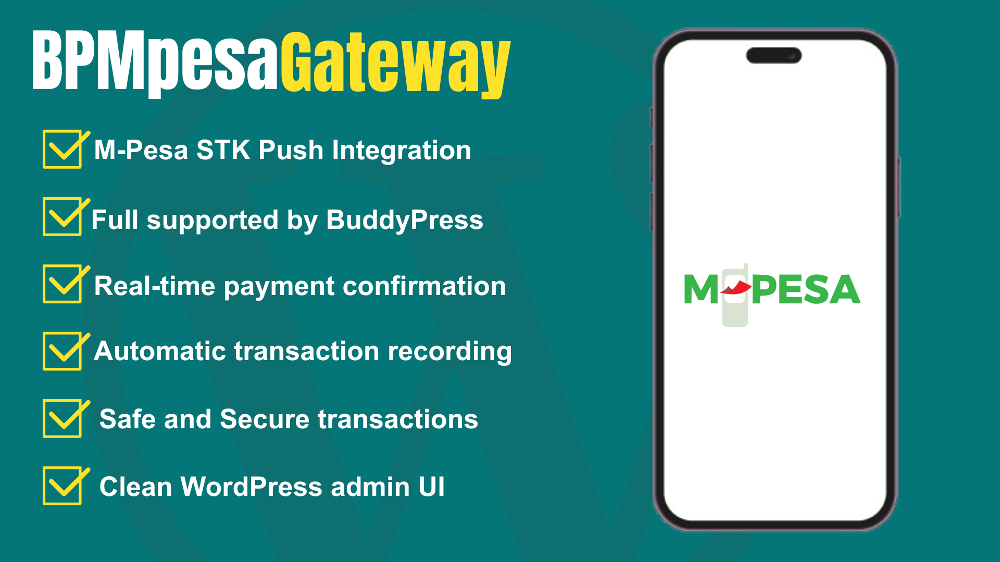

# BPMpesaGateway

<div align="center">



A powerful WordPress plugin that integrates M-Pesa payment processing with BuddyPress, enabling site administrators to require payment before users can register or join a BuddyPress-powered community.

[](https://wordpress.org)
[](https://php.net)
[](https://www.gnu.org/licenses/gpl-3.0.html)

</div>

---

## Table of Contents

- [Features](#features)
- [Requirements](#requirements)
- [Installation](#installation)
- [Using Ngrok](#local-development-with-ngrok)
- [Project Structure](#project-structure)
- [Contributing](#contributing)
- [Credits](#credits)
- [License](#license)
- [Contact](#contact)

---

## Features

- **M-Pesa Integration** - Seamless M-Pesa payment gateway integration
- **BuddyPress Compatible** - Require payment before user registration
- **Secure** - Built with WordPress security best practices
- **Easy Configuration** - Simple admin settings for M-Pesa credentials
- **Auto-Updates** - Automatic plugin updates from remote server
- **Mobile Friendly** - Works perfectly on mobile devices

---

## Requirements

- **WordPress:** 6.2.1 or higher
- **PHP:** 8.1 or higher
- **BuddyPress:** Required plugin
- **Composer:** For dependency management

---

## Installation

### Method 1: Manual Installation

1. **Download the Plugin**
   - Download the BPMpesaGateway plugin folder

2. **Upload to WordPress**
   - Connect to your server via FTP/SFTP
   - Navigate to `/wp-content/plugins/`
   - Upload the `BPMpesaGateway` folder

3. **Activate the Plugin**
   - Go to WordPress Admin Dashboard
   - Navigate to **Plugins** → **Installed Plugins**
   - Find "BPMpesaGateway" and click **Activate**

4. **Configure M-Pesa Settings**
   - Go to **Dashboard** → **BPMpesaGateway Settings**
   - Enter your M-Pesa credentials:
     - Consumer Key
     - Consumer Secret
     - Business Shortcode
     - Passkey
     - Account Reference
     - Transaction Description
     - Amount

---

## Local Development with ngrok

To test the plugin locally with HTTPS (required for secure M-Pesa callbacks), you can use ngrok to expose your local WordPress installation.

#### Setup Steps

1. **Install ngrok**: Download from [ngrok.com](https://ngrok.com) or install via package manager

2. **Configure wp-config.php**: Add the following code to your `wp-config.php` file before the line `/* That's all, stop editing! */`:

```php
define('WP_HOME', 'https://XXXX.ngrok-free.dev');
define('WP_SITEURL', 'https://XXXX.ngrok-free.dev');

define('FORCE_SSL_ADMIN', true);
define('FORCE_SSL_LOGIN', true);

if (isset($_SERVER['HTTP_X_FORWARDED_PROTO']) && $_SERVER['HTTP_X_FORWARDED_PROTO'] === 'https') {
    $_SERVER['HTTPS'] = 'on';
}
```

Replace `XXXX` with your actual ngrok subdomain.

3. **restart apache2**: once you add the code to your wp-config, you need to restart apache2 for changes to take effect
```bash
sudo systemctl restart apache2
```

4. **Start ngrok**: Run the following command in your terminal:

```bash
ngrok http <port>
```

Replace `<port>` with your local WordPress server port (typically 8000, 8080, 3000, etc.)

Example:
```bash
ngrok http 8000
```

5. **Test Payment Flow**: You can now test M-Pesa payment processing with full HTTPS support

## Project Structure

```
BPMpesaGateway/
├── BPMpesaGateway.php              # Main plugin file
├── composer.json                    # Composer configuration
├── index.php                        # Plugin index
├── LICENSE.txt                      # License file
├── readme.txt                       # WordPress plugin readme
├── uninstall.php                    # Uninstall hook
│
├── admin/                           # Admin-facing code
│   ├── BPMG-admin.css             # Admin styles
│   └── BPMG-admin.js              # Admin scripts
│
├── includes/                        # Core plugin includes
│   ├── base/                       # Base classes
│   │   ├── BPMG.php               # Main plugin class
│   │   ├── BPMG_Activator.php     # Activation hook
│   │   ├── BPMG_Deactivator.php   # Deactivation hook
│   │   ├── BPMG_Admin_Pages.php   # Admin pages
│   │   ├── BPMG_Enqueue_Admin.php # Admin assets
│   │   ├── BPMG_Enqueue_Public.php # Frontend assets
│   │   └── BPMG_Post_Types.php    # Custom post types
│   │
│   ├── core/                       # Core functionality
│   │   ├── BPMG_Mpesa.php         # M-Pesa integration
│   │   └── BPMG_Registration.php  # Registration hooks
│   │
│   ├── templates/                  # Template files
│   │   ├── admin-template.php     # Admin UI
│   │   └── registration-fields.php # Registration form
│   │
│   └── utils/                      # Utility functions
│       └── BPMG_Utils.php         # Helper utilities
│
├── public/                          # Frontend-facing code
│   ├── BPMG-public.css            # Frontend styles
│   └── BPMG-public.js             # Frontend scripts
│
└── vendor/                          # Composer dependencies
    ├── autoload.php               # Composer autoloader
    └── yahnis-elsts/              # Plugin update checker
        └── plugin-update-checker/
```

---

## How to Use

### For Site Administrators

1. **Install and Activate** the plugin (see Installation section)
2. **Configure M-Pesa Settings:**
   - Navigate to the BPMpesaGateway settings page
   - Fill in your M-Pesa API credentials
   - Set the payment amount for registration
3. **User Registration** will now require M-Pesa payment
4. **Monitor Transactions** through the admin dashboard

### For Users

1. Users attempting to register will be prompted to make an M-Pesa payment
2. Follow the STK Push notification on your mobile phone
3. Complete the M-Pesa payment
4. Upon successful payment, your account will be created automatically

---

## Contributing

We welcome contributions from the community! Here's how you can help:

### Steps to Contribute

1. **Fork the Repository**
   ```bash
   git clone git@github.com:peanutsx50/BPMpesaGateway.git
   cd BPMpesaGateway
   ```

2. **Create a Feature Branch**
   ```bash
   git checkout -b feature/your-feature-name
   ```

3. **Make Your Changes**
   - Follow WordPress coding standards
   - Write clean, documented code
   - Test thoroughly

4. **Commit Your Changes**
   ```bash
   git add .
   git commit -m "Add your meaningful commit message"
   ```

5. **Push to Your Fork**
   ```bash
   git push origin feature/your-feature-name
   ```

6. **Submit a Pull Request**
   - Provide a clear description of your changes
   - Reference any related issues

### Contribution Guidelines

- Follow [WordPress Coding Standards](https://developer.wordpress.org/coding-standards/)
- Use meaningful variable and function names
- Add comments for complex logic
- Test on WordPress 6.2.1+
- Ensure PHP 8.1+ compatibility
- Include inline documentation

### Reporting Bugs

Found a bug? Please report it by:
1. Checking if the issue already exists
2. Providing detailed steps to reproduce
3. Including your WordPress version and PHP version
4. Describing the expected vs actual behavior

---

## Credits

### Third-Party Libraries

**[Plugin Update Checker](https://github.com/YahnisElsts/plugin-update-checker)** by **Yahnis Elsts**
- License: MIT
- Purpose: Automatic plugin updates from remote server
- We extend our gratitude to Yahnis Elsts for maintaining this excellent library

### M-Pesa Integration

- M-Pesa API integration powered by Safaricom's official M-Pesa API

### Community

Special thanks to the BuddyPress and WordPress communities for their continuous support and resources.

---

## License

This plugin is licensed under the GNU General Public License v3.0 (GPLv3). See [LICENSE.txt](LICENSE.txt) for details.

```
BPMpesaGateway is free software: you can redistribute it and/or modify
it under the terms of the GNU General Public License as published by
the Free Software Foundation, either version 3 of the License, or
(at your option) any later version.
```

---

## Contact & Support

**Developer:** Festus Murimi

- **LinkedIn:** [Festus Murimi](https://www.linkedin.com/in/festus-murimi-b41aa2251/)
- **Email:** [Contact via LinkedIn](https://www.linkedin.com/in/festus-murimi-b41aa2251/)
- **Documentation:** [Plugin Documentation](https://surgetech.co.ke/bpmpesagateway)

### Support

For support, feature requests, or bug reports:
1. Check the documentation first
2. Review existing issues on GitHub
3. Create a new issue with detailed information
4. Contact the developer via LinkedIn

---

## Changelog

### Version 1.0.0 (2025)
- Initial release
- M-Pesa payment gateway integration
- BuddyPress registration payment requirement
- Admin dashboard configuration
- Automatic plugin updates

---

<div align="center">

Made with ❤️ by [Festus Murimi](https://www.linkedin.com/in/festus-murimi-b41aa2251/)

[Report Bug](https://github.com) · [Request Feature](https://github.com) · [View Documentation](https://shorturl.at/E4V3K)

</div>
